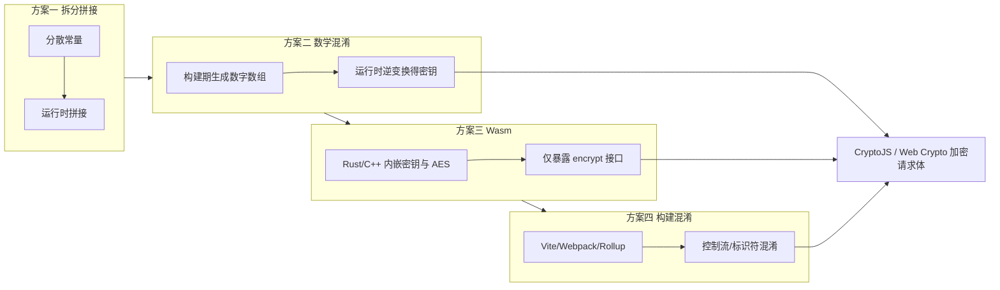

# 前端无法改架构时，如何尽量藏住 AES 密钥：四层防御实践

## 背景：问题从哪来

很多存量项目已经定型：**统一网关、单一 POST、请求体走国密（SM2 包密钥 + SM4 包体）**。在这种架构下，密钥协商、公钥下发、白名单等往往由后端和网关说了算，**前端很难把「对称密钥永远不出浏览器」这件事做成真安全**。

更现实的情况是：

- 业务仍要在浏览器里用 **AES / 自定义对称加密** 处理部分字段；
- 打包后的 JS 里一旦出现 `const SECRET_KEY = 'xxx'`，任何人打开 DevTools → Sources 就能搜到；
- 团队短期内 **不能改网关、不能上 HSM、不能全量迁到 WebCrypto + 服务端托管密钥**。

这时目标应调整为：**不是「绝对防破解」，而是「提高静态分析与自动化扒密钥的成本」**——让攻击者从「搜字符串」变成「读混淆逻辑 / 跑逆变换 / 拆 Wasm」。

下文四个方案由浅入深，可单独使用，也可组合。

---

## 安全边界（务必先读）

| 能做到 | 做不到 |
|--------|--------|
| 提高源码阅读、字符串搜索、脚本批量提取密钥的难度 | 阻止有耐心的逆向者在本地调试器中拿到运行时密钥 |
| 把密钥生命周期缩短到「加密瞬间」 | 替代 HTTPS、替代服务端鉴权、替代真正的密钥托管 |
| 与打包混淆、Wasm 叠加抬高门槛 | 防不住 XSS：脚本能在内存里读到 `tempKey` |

**结论**：这是 **纵深防御（Defense in Depth）** 里的前端一层，不是密码学意义上的「密钥安全存储」。

---

## 整体思路



推荐组合：**方案二（密钥不以明文出现）+ 方案三或四（逻辑难读）+ 用完即丢的密钥变量**。

---

## 方案一：密钥拆分与动态拼接

### 思路

不把完整密钥写成单个字符串，而是拆进「看起来像业务配置」的数组和对象里，在不起眼的路径上拼接。能挡掉：**全局搜索 `secret_key`**、简单正则扫密钥。

### 局限

熟练的人仍会跟 `getServiceToken()` 的返回值，或直接在调用栈里看拼接结果。

### 核心代码

```javascript
// 干扰项：看起来像业务配置
const CONFIG_A = ['user', 'timeout', 'ey_123'];
const SYSTEM_FLAGS = { mode: 'prod', prefix: 'my_sec' };
const DEFAULTS = ['ret_', 'auth', 'page'];

function getServiceToken() {
  // 真实密钥: "my_secret_key_123"
  return SYSTEM_FLAGS.prefix + DEFAULTS[0] + CONFIG_A[2];
}

function encryptPayload(plainText) {
  const key = getServiceToken();
  try {
    return CryptoJS.AES.encrypt(plainText, key).toString();
  } finally {
    // 无法从语言层面「擦除」内存，但可减少闭包长期持有
    // key 随函数栈结束可被 GC（仍可能被调试器截获）
  }
}
```

### 落地建议

- 拼接函数名、文件名避免 `getSecretKey`、`decryptKey`。
- 把片段散在 2～3 个模块里，经一层无意义的 `map/filter` 再拼（注意别影响性能热点路径）。
- **仅作第一层**，不要单独依赖。

---

## 方案二：构建期数学变换（XOR + 偏移）

### 思路

1. **本地 Node 脚本**（不进仓库、不进 CI 产物）持有真实 AES 密钥；
2. 对密钥每个字符做 **异或 + 算术偏移**，得到纯数字数组；
3. 把数组以「日志级别 / 布局指标」等名义写进前端；
4. 加密前 **现场逆变换** 得到 `tempKey`，用完不挂到全局。

攻击者静态分析时看到的是 `[78, 126, 44, ...]`，而不是 `Key_2026_Secure!`。

### 构建期：生成混淆数组（仅本机运行）

```javascript
// scripts/generate-key-obfuscation.mjs — 不要提交 REAL_KEY
import { writeFileSync } from 'fs';

const REAL_KEY = 'Key_2026_Secure!';
const MASKS = [0x5a, 0x3c, 0x7e];
const OFFSET = 13;

function generateObfuscatedData(key) {
  const result = [];
  for (let i = 0; i < key.length; i++) {
    let code = key.charCodeAt(i);
    code = code ^ MASKS[i % MASKS.length];
    code = code + OFFSET;
    result.push(code);
  }
  return result;
}

const obfuscated = generateObfuscatedData(REAL_KEY);
const out = `export const SYSTEM_LOG_LEVELS = ${JSON.stringify(obfuscated)};\n`;
writeFileSync('./src/crypto/key-obfuscated.ts', out);
console.log('已写入 src/crypto/key-obfuscated.ts');
```

### 运行时：伪装函数名 + 逆变换 + 加密

```javascript
// src/crypto/layout-metrics.js
import CryptoJS from 'crypto-js';
import { SYSTEM_LOG_LEVELS } from './key-obfuscated';

const LOG_CONFIG_A = [0x5a, 0x3c, 0x7e];
const BASE_PADDING = 13;

/** 伪装：计算页面布局指标 */
function calculateLayoutMetrics(dataArray) {
  const recovered = [];
  for (let i = 0; i < dataArray.length; i++) {
    let num = dataArray[i] - BASE_PADDING;
    const mask = LOG_CONFIG_A[i % LOG_CONFIG_A.length];
    recovered.push(String.fromCharCode(num ^ mask));
  }
  return recovered.join('');
}

export function doSecureEncryption(plainText) {
  const tempKey = calculateLayoutMetrics(SYSTEM_LOG_LEVELS);
  try {
    return CryptoJS.AES.encrypt(plainText, tempKey, {
      mode: CryptoJS.mode.ECB, // 示例；生产请用 CBC/GCM 并配 IV
      padding: CryptoJS.pad.Pkcs7,
    }).toString();
  } finally {
    // tempKey 不要赋给 window / 模块级变量
  }
}
```

### 与请求拦截器结合（示意）

若项目已有统一 `axios` 拦截器（类似网关 SM2/SM4 架构），可在 **白名单外的敏感字段** 上挂一层：

```javascript
// request interceptor 片段
import { doSecureEncryption } from '@/crypto/layout-metrics';

instance.interceptors.request.use((config) => {
  if (config.meta?.fieldEncrypt && config.data?.password) {
    config.data.password = doSecureEncryption(config.data.password);
  }
  return config;
});
```

### 增强点

- `MASKS`、`OFFSET` 也可做成多组，按索引轮换；
- 数字数组可再 **Base64 一层** 或拆成两个数组 XOR 合并；
- 逆变换逻辑与数组分文件，构建期脚本 **不进入 git**（用 `.gitignore` + CI 密钥注入生成）。

---

## 方案三：Rust/C++ 编译 Wasm，密钥与 AES 不进 JS

### 思路

- 用 **Rust + `aes` / `ring`** 或 C++ 实现 AES；
- 密钥常量只存在于 **Wasm 线性内存与机器码** 里；
- 前端只 `import init, { encrypt } from './crypto_bg.wasm'`。

浏览器里看到的是二进制模块；逆向需要 Wasm 反编译、Ghidra/IDA，门槛明显高于读 JS。

### Rust 核心示例（`wasm-bindgen`）

```rust
// crypto-wasm/src/lib.rs
use wasm_bindgen::prelude::*;
use aes::Aes128;
use aes::cipher::{BlockEncrypt, KeyInit, generic_array::GenericArray};

// 密钥硬编码在 Wasm 内（示例 16 字节）
const KEY: [u8; 16] = *b"Key_2026_Secure!";

#[wasm_bindgen]
pub fn encrypt_hex(plain: &str) -> String {
    let mut block = GenericArray::clone_from_slice(plain.as_bytes());
    // 生产应使用 CBC/GCM、PKCS7 填充；此处仅演示 ECB 单块
    let cipher = Aes128::new(GenericArray::from_slice(&KEY));
    cipher.encrypt_block(&mut block);
    block.iter().map(|b| format!("{:02x}", b)).collect()
}
```

```toml
# crypto-wasm/Cargo.toml
[package]
name = "crypto-wasm"
version = "0.1.0"
edition = "2021"

[lib]
crate-type = ["cdylib"]

[dependencies]
wasm-bindgen = "0.2"
aes = "0.8"
```

```bash
wasm-pack build --target web --release
```

### 前端调用

```javascript
// src/crypto/wasm-crypto.js
import init, { encrypt_hex } from '../../../crypto-wasm/pkg/crypto_wasm.js';

let ready = null;

export async function wasmEncrypt(plainText) {
  if (!ready) {
    ready = init(); // 加载 .wasm
  }
  await ready;
  return encrypt_hex(plainText);
}
```

### 注意

- Wasm **不是**「无法逆向」，只是成本更高；
- 发布时用 `wasm-opt -Oz` 减小体积；
- 仍要配合 HTTPS；XSS 仍可调用 `encrypt_hex` 伪造密文。

---

## 方案四：构建链混淆（Webpack / Vite / Rollup）

### 思路

在 **方案一～三** 之上，对最终 bundle 做：

- 标识符混淆（`_0x3f2a`）
- 控制流平坦化
- 字符串数组旋转
- 禁用 `sourceMap` 或仅内网保留

### Vite 示例（`rollup-plugin-obfuscator`）

```javascript
// vite.config.js
import { defineConfig } from 'vite';
import vue from '@vitejs/plugin-vue';
import obfuscator from 'rollup-plugin-obfuscator';

export default defineConfig({
  plugins: [vue()],
  build: {
    sourcemap: false,
    rollupOptions: {
      plugins: [
        obfuscator({
          global: true,
          options: {
            compact: true,
            controlFlowFlattening: true,
            stringArray: true,
            stringArrayThreshold: 0.75,
            rotateStringArray: true,
            deadCodeInjection: false, // 体积敏感时关闭
          },
        }),
      ],
    },
  },
});
```

### Webpack 示例（`javascript-obfuscator-webpack-plugin`）

```javascript
const JavaScriptObfuscator = require('javascript-obfuscator-webpack-plugin');

module.exports = {
  mode: 'production',
  devtool: false,
  plugins: [
    new JavaScriptObfuscator({
      rotateStringArray: true,
      stringArray: true,
      controlFlowFlattening: true,
    }),
  ],
};
```

### 实践建议

- **只混淆** 含密钥还原、加密逻辑的 chunk（`manualChunks`），避免全站包体积和首屏暴涨；
- 与 **Terser** 默认压缩叠加，先压缩再混淆或按插件文档顺序配置；
- 混淆后务必做回归：部分库（依赖 `Function.prototype.toString`）会挂。

---

## 四层方案对比

| 方案 | 实现成本 | 静态分析难度 | 运行时调试 | 维护成本 |
|------|----------|--------------|------------|----------|
| 一、拆分拼接 | 低 | 低 | 易跟栈 | 低 |
| 二、XOR+偏移 | 中 | 中 | 需跟逆变换 | 中（构建脚本） |
| 三、Wasm | 高 | 高 | 需 Wasm 逆向 | 高（Rust 工具链） |
| 四、打包混淆 | 中 | 中～高 | 仍可在断点看内存 | 中（构建变慢） |

**推荐组合**：二 + 三 + 四；一可作为额外噪音。

---

## 密钥生命周期（各方案通用）

```javascript
async function submitSensitiveForm(payload) {
  const { password, ...rest } = payload;
  const cipherPassword = await doSecureEncryption(password); // 或 wasmEncrypt
  await api.post('/gateway', { ...rest, password: cipherPassword });
  // 不要在模块级缓存 password / tempKey
}
```

原则：

1. **密钥只在加密函数栈内存在**；
2. 不挂 `window.__KEY__`、不写入 `localStorage`；
3. 与网关 **SM2/SM4** 分工清晰：网关管传输层国密，前端局部 AES 管「不得明文出现在某段 JS 字符串里」的合规诉求。

---

## 总结

在 **不能改统一网关架构** 的前提下，前端对「明文密钥」能做的，是 **分层抬高攻击成本**：

1. **拆分拼接** — 防随手搜字符串；
2. **构建期 XOR 数组** — 密钥不以明文进仓库；
3. **Wasm** — 把核心算法和密钥赶出 JS AST；
4. **构建混淆** — 让自动化分析更痛苦。

没有任何一层能替代「密钥应在服务端」这一根本原则；但在交付压力下，**二 + 三 + 四** 往往是性价比最高的务实组合。
